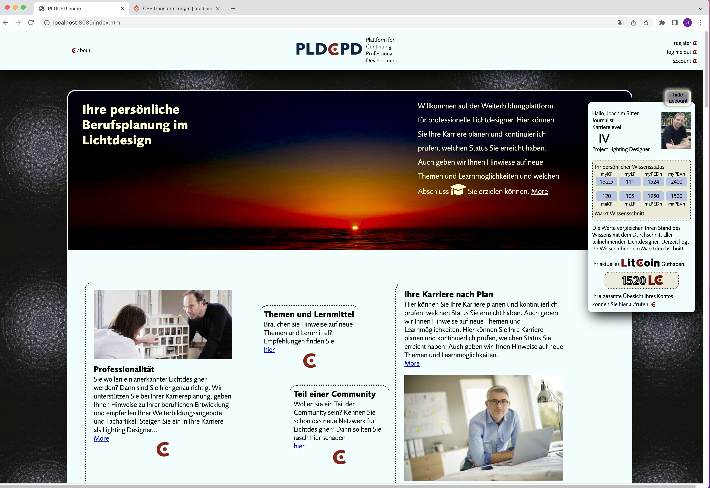

# pldcpd

### About the project

  International Plattform for coordinating CPD (Continuing Professional Development) for lighting designers, architects and engineers in architecture.

### Status

Still in development... Launch planned in Jan 2023.

  
### How to use this project

Search for educational opportunities based on your level of professional carrer. 

##### Developed with

- [x] _HTML5_
- [x] _CSS3_
- [ ] _SASS_
- [x] _SCSS_
- [x] _JavaScript_
- [ ] _React_
- [ ] _Bootstrap_
- [x] _npm_
- [ ] _..._

---

### Contact

Mail: <jritter@via-internet.com> 
GitHub: [Joachim Ritter](https://github.com/KazhimRycerz) 
LinkedIn: [Joachim Ritter](https://www.linkedin.com/in/joachimr/) 
Xing: [Joachim Ritter](https://www.xing.com/profile/Joachim_Ritter19/) 
Instagram: [Joachim Ritter](https://www.instagram.com/ritter_joachim/) 

---

### Used Tools

- [ionicons](https://)
- [Canva](https://www.canva.com/)
- [npm](https://www.npmjs.com/)
- [Google Fonts](https://fonts.google.com/)
- [Visual Studio Code](https://code.visualstudio.com/)
- [ColorZilla](https://www.colorzilla.com/chrome/)
- [Font-Awesome](https://fontawesome.com/)

---

© Joachim Ritter